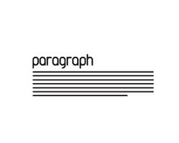

# webproject
presentation
<!DOCTYPE html>
<html lang="en">
<head>
    <meta charset="UTF-8">
    <meta name="viewport" content="width=device-width, initial-scale=1.0">
    <title>myself</title>
    <link href='https://unpkg.com/boxicons@2.1.4/css/boxicons.min.css' rel='stylesheet'>
    <link rel="stylesheet" href="mycss.css">
</head>
<body>
    

        <nav class="bar">
            <a href="#" class="logo">portfolio.</a>
            <!--  -->
            <ul>
                <li><a href="#details">HOME</a></li>
                <li><a href="#skills">SKILLS</a></li>
                <li><a href="#project">PROJECT</a></li>
                <li><a href="#contact">CONTACT</a></li>
            </ul>
        </nav>
        

            <h1>I,m Mahamad Razaq<samp>A R</samp></h1>
            
This i my official portfolio
                  web page to show you all 
                 about my work
            

            

                <a href="https://www.instagram.com/itsmeraza27?igsh=YjJucXRxOGM2eWNi"><i class='bx bxl-instagram-alt'></i></a>
                <a href="https://www.linkedin.com/home"><i class='bx bxl-linkedin' ></i></a>
                <a href="https://facebook.com"><i class='bx bxl-facebook'></i></a>
            

        

        

            
            
            
        

    

    

        <h2 class="heading">SKILLS</h2>
        <h3>WEB DEVELEPOR</h3>
            <li>HTML</li>
           <li>CSS</li>
            <li>java script</li>
            <li>good command over programming concepts as java</li>
            <li>Scripting languages</li>
            <li>Analytical thinking</li>
            <li>Aplication Develepment</li>
        
    

    

        <h2 class="heading">PROJECT</h2>
        
        
        
        
        
        
    

    

        <h1 class="">Contact<samp>Me</samp></h1>
        <h3>MAHAMAD RAZAQ A R</h3>
        <h3>HARIHARA</h3>
        <h3><samp>📞</samp>7619420127</h3>
        <form action="mailto:mahamadrazaq27@gmail.com">
            <table>
                <tr>
                    <!-- <td><label for="username">Name</label></td> -->
                    <td><input type="text" placeholder="Name"></td>
                </tr>
                <tr>
                    <!-- <td><label for="number">Phone no.</label></td> -->
                    <td><input type="number" placeholder="Phone no."></td>
                </tr>
                <tr>
                    <!-- <td><label for="messege">Messeage</label></td> -->
                    <td><textarea name="body" placeholder="Messeage"></textarea></td>
                </tr>
                <tr>
                    <!-- <td></td> -->
                    <!-- <td><button type="submit"><a href="">Submit</a></button></td> -->
                    <td><button type="submit">send</button></td>
                </tr>
            </table>

        </form>
    

</body>
</html>
